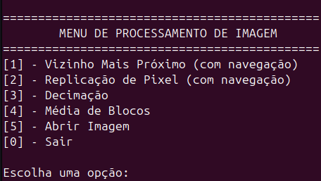

<h1 align="center"> 
 Zoom Digital: Integração HPS-FPGA e API em Assembly
</h1>

---

## 🧩 Descrição do Projeto

O projeto é a **continuação** do desenvolvimento de um **módulo embarcado** para **redimensionar imagens em tempo real** na placa DE1-SoC. Enquanto a primeira etapa focou na implementação do **coprocessador gráfico em Verilog (FPGA)**, esta segunda etapa concentra-se na **integração software-hardware** e na criação de uma **API (Application Programming Interface)** para controlar o coprocessador a partir do **Hard Processor System (HPS) ARM** da placa.

O objetivo é transformar o controle de hardware (botões) em chamadas de software, permitindo que uma aplicação em C carregue uma imagem de um arquivo e utilize as funcionalidades de zoom (aproximação) e redução (downscale) do coprocessador.

---

## 📝 Requisitos da 2ª Etapa

- O código da API deve ser escrito em **linguagem Assembly**.  
- O sistema só poderá utilizar os **componentes disponíveis na placa**.  
- A API deve implementar os **comandos da ISA do coprocessador**.  
  - As instruções devem utilizar as operações previamente implementadas via **chaves e botões na placa** (ver Problema 1).  
- As imagens devem ser representadas em **escala de cinza**, sendo que cada pixel é representado por um **número inteiro de 8 bits**.  
- A imagem deve ser **lida a partir de um arquivo** e transferida para o coprocessador.  
- O coprocessador deve ser **compatível com o processador ARM (Hard Processor System - HPS)** para viabilizar o desenvolvimento da solução.

---

## ⚙️ Especificações

- **🧠 Linguagem Principal:** Assembly ARM (para a API/Driver) e C (para a aplicação de teste)
- **💻 Kit de desenvolvimento:** DE1-SoC (HPS ARM + FPGA)
- **🎨 Tipo de imagem:** Escala de cinza (8 bits por pixel)
- **🔧 Operações controladas:**
  - **Zoom In (Aproximação):** Vizinho Mais Próximo e Replicação de Pixel
  - **Zoom Out (Redução):** Decimação e Média de Blocos
- **🎛️ Controle:** Aplicação em C com interface de texto (teclado)
- **🖥️ Saída de vídeo:** VGA (controlada pelo módulo FPGA)
- **🔗 Interface:** Mapeamento de memória (`/dev/mem`) para comunicação entre HPS e FPGA
- **🛠️ Ferramentas de desenvolvimento:** 
  - Quartus Prime II versão 23.1  
  - Platform Designer (para criação dos módulos PIO)

---

## 🛠 Hardware (DE1-SoC)

O projeto utiliza a arquitetura **System-on-Chip (SoC)** da placa DE1-SoC, que integra um **Hard Processor System (HPS)** baseado em ARM Cortex-A9 dual-core e a lógica programável do **FPGA Cyclone V**.

A comunicação entre o software (rodando no HPS) e o hardware (o coprocessador gráfico na FPGA) é realizada através da **ponte de interconexão leve (Lightweight HPS-to-FPGA Bridge)**, que permite o mapeamento de registradores da FPGA na memória do HPS.

---

## ⚙️ Mudanças no Hardware (FPGA)

Para suportar a comunicação com o HPS e o novo modelo de controle via software, o hardware do coprocessador gráfico implementado na FPGA sofreu as seguintes modificações em relação à Fase 1 do projeto:

- **Criação dos PIOs (Parallel Input/Output):** Implementação de registradores mapeados na memória para comunicação direta com o HPS.
- **Modificação da primeira memória:** Modificação da memória original para memória de 2 portas para suportar o carregamento via HPS.
- **Implementação de um módulo Decoder:** Módulo responsável por decodificar a instrução de 32 bits (ISA) enviada pelo HPS, acionando o módulo de processamento correspondente.
- **Ajuste na máquina de estados das imagens:** Revisão da lógica de controle para gerenciar o fluxo de dados e o estado da imagem (original/processada) de forma assíncrona ao controle do HPS.
- **Inclusão dos módulos necessários para a comunicação com o HPS:** Integração da ponte Lightweight HPS-to-FPGA e dos registradores de controle/dados.
- **Revisão e ajuste das conexões de ativação dos algoritmos:** O controle dos algoritmos passa a ser feito pelo módulo Decoder, substituindo a ativação direta pelos botões físicos.
- **Adição dos offsets utilizados pelos algoritmos de Zoom In:** O hardware foi adaptado para receber e utilizar os valores de Offset X e Y, contidos na instrução de 32 bits, para controlar a região de visualização nos algoritmos de Vizinho Mais Próximo e Replicação de Pixel.

---

## 📜 Caminho de dados

O caminho de dados contendo apenas as modificações realizadas pode ser visualizado na imagem abaixo.  
As alterações incluem:

- **Adição do HPS**
- **Modificação da memória primária**
- **Criação do decoder**
- **Inclusão dos offsets**
- **Ajuste na lógica de fluxo de dados**


🔗 [Ver em alta qualidade](https://viewer.diagrams.net/?tags=%7B%7D&lightbox=1&highlight=0000ff&layers=1&nav=1&title=Caminho%20de%20Dados%20Simplificado.drawio&dark=auto#R%3Cmxfile%3E%3Cdiagram%20name%3D%22P%C3%A1gina-1%22%20id%3D%22gjH22BMqtbLyWabGkIET%22%3E7V1bd6q6Fv41jnHOgw6SQIBHqtTl2K161J52nZcOW9nWVSs9lK6269dvUKKQGQSUi5f60EogMcxv3pLMzNRI8%2BWz7Yxfn67tiTWvYWnyWSOtGsaypEveP7%2FkKyghmK5Kps5ssipDm4Lh7I8VFAYVp%2B%2BzifUWedC17bk7e40WPtqLhfXoRsrGjmN%2FRB%2F7255Hf%2FV1PLVAwfBxPIelt7OJ%2B7Qq1bC6Kf9hzaZP7JcR1Vd3HsaPz1PHfl8Ev1fD5HL5Wd1%2BGbO2ghd9expP7I9I0XgyfnVnv62mPbed4D0W9sLy7xKzRpqObburby%2BfTWvuk54RddXEZczd9Vs51sJNU%2BHyQaFvP%2B6GaGr%2BB00k4%2Bqne1FXVq38Hs%2FfLfaSy1dxvxj5lgSw%2FEakGrn4eJq51vB1%2FOjf%2FfA4xit7cl%2Fm3hXyvr7Yv8cPy5r%2BlWO9zf6Er2137IauPVazwtfWZBa%2BnNuPz%2BsfDrgjdBsSIKDJb8txrc9QUUCQtmW%2FWK7z5T0S3K3LagBUwNx1REhQ8rHhFaQyIXgKMwqlDOUA2en6BzY4eF8CKMSwdN%2Fn8z9t7X6IR%2B%2FyeHh9pc7tuqIKcKHjF5%2Fai4c3%2F1%2Bz1x0Neldb4ELJcOVBQkw5EmoapKBGBASU86CfkK2piHxz72cv%2Fra9Nw0TjP7%2F3WY36m9L5WV4D1Dp9XNJIHbf%2Bzb1%2F1%2F22wZrzOvbqr3VLYCFR0I3SnARHm%2BuYz%2BvNIRXuNQOXndm8zlXNJ7Ppgvv8tEDy%2FLKL3yQZp6eM4IbL7PJxP%2Fpi6jIrtpnqk%2FKCXai8JKDFYg7FcBOCkNdBQhYE88UBJe24z7ZU3sxnpubUo5Wm2eubPs1AO2X5bpfgV0bv7t2FFLrc%2BbeBdX97z%2F97w2sBJetz9C91he7WHgvfBe%2BWFVT2OWm2vJqU48ZWLIVyDf73Xm0UmgYd%2BxMLXcLUdWgRZ%2BSWxnDseZj39RF7bcA42VVw3HGX6EHXu3Zwn0Ltdz3C8L8xqsZlSpRe5dUAysKx2KrTsRUl1FDUVV9%2FVGV6O%2FLmoeyHroffeMVAkGjHGOvqbY7r7PelMzrUfbblYtj2TbMjU%2F0i85nfbnp2b3Ji4ztX32zTvCBcKPEcaOikQRu5GswBRpXQ97zeUQysTsw4%2ByNkjgaNIVQtCVe369ALk4yDsgKqJ5J2moGvIu%2B5cy8d%2FYtukjFx8kY3lnIdrINQmlUD0MYscazbjC2ixVGUIOo24WL8tKRuQKSIxVSWB%2Bs6RL7YMRZHxXThiptPrvKqqTJkYZVWq6waocjrBqRi%2FHZkoW8BFnVDkRW%2BQG3rNMEWeVrEG276OlAuLNWyGg6E2VVUar0FPUqRawuNSQJReRM0RLGRgJ5iY5hBa7o%2FhJUtWQQzm2qU4S2SwaogZRcbQwluKFruxmW%2BnoKlO9cWaZFZwxwAKZF8WHPyQ9cSpQSNUGUqIkTB94V%2FxMlmB35QISL50Yqb7cJghoJA7x1r8UVEoXRGy0gaWMjNF4YJdygeG%2BHD8qlVrJYVjNxIRRLWaH5iiWOiqVner%2BlcptUEl7GEkZVsEYwIZSTkCkqzmNUVbmQsbmg0ALIcGQMRvcXV73mX%2FfGf82B0e5020AUD2PFIlYCMqxPIE3jsEXB3GFVyxMyAqCwhaTJ7DdbRFrh1O3ed7ojc9DvXRmjTq8bWnEKPXvS8KkcfIx8lcGHM8H3v17v%2Br53Mzo75LCEOeTYulxlyJEYbTgw%2B1edZiBgJwwIpwkplisGBIad9C4vh%2Bbo%2Fu6UceBXaKhSNQ4wTiLA4edZ4aBVjQMM92kZI%2BO%2Bc220zVNGgpAoEiqqGgkt1lR4YnHKUGDeXdartto6gOJ2YHbPQCj4QBcW61EVEgocTRqtlicRw9MHgx%2FIq3LFYFAMyF3Z%2FBnRt0%2BfcVNlwtm0nCOIdl3uSREJRyuaJOPdFVVKWhfiaiAl2yRZQuCbQvQGDS1n7rhCpEc7ue50SVNkFFp65LGGdNEZDVMotPRKSaT68ldUBFGOS2g6V4one36KCtpvqLkWE8Pf4bFR9iESpyRS4iR2iACKgACsrOjAB7YeuYng0bNIZWz9HWanNb4pwjVVdNRPpTZMEJLgS09BcXoVWzLh8g%2BuxpDxOwZUkhTBzdVgU4s5xTcoyLN0JGTJuNi31AKFxN0sTZzg%2FOZZa1qNm1WgulrLwDax9XfQtCo%2FwSFxTRXNGjJgDe2YnRygQdJtOSrMyWHhsmVvw8hl99AWg%2BhPxGU1iPtbskTDRVMqosJ9OT7gPDrCSlGDbU6KqwGMZeYKmYNYeaXHyUzBYao6NGKnpKlYZEtlmkqHluC8nQQQ7Jptu1Rc%2FV2cBL4pmWuq6JA80Xbpc2YN3v%2BjGVkjpn4O%2FiNVS2YNuDJ5SlpZlSrWyoiFGB7IPl5BaDmliV5lliDWY9lUyMd%2Fk4T9fspejzMXOKWKiQtOz6xhKNiOVdgsfP%2FG%2FWtk2d1L5WX27LRcQ71266jaTRoNTLXIuEdPWtFaCwqOykmSjOS0BzBGiVAoW2JyS3kLV1rtJ%2B6OwM8oE31CcAh9lBZ6fw04hH008j8TAwgU51lxxfaO55aVKg%2FfAWaK0gTOQ0ymqMKiAZAkzBSVT6qjH%2F3hd6Yjf6s%2Ft7SKVIU20oWByKQo4BGMofX3whypaw63skoYSpcqoHBhOcQQ%2Bh4Wh%2BcXJW5Dhq5lGRXHVs%2FsshLEt6QXNiYmxmUdGb078jB6%2FqMbz%2Fet2%2Bs6gjNpLbPZa5mDLVaqnGR8IFeCJkMpEjIRT8NdxEhMLainOt3haHDTPO1tF2DGXwRFUZGDYiSgPjO7xsXVCcdvynxUs1biLjKhr13NeuFmvMtSb2Qa8GQb6u4wgBGSKlAc4eHLVg1zIIPaatOPNdRTRDj3dd%2B9EIYWrd27apmeMZN%2BGIPWrTHwVKo0MC%2FNgdlt%2Bt9b5rDThsaudPcA5GTBAqNE2HJFZAjL72DPjZowDvc8%2FAOQdGqdab0q2wQDdk%2FePwBZ%2BioHAVXsIWSyH3GrSJnMye72g00aJM5wsg3POS8qwRysOm1ooSQ9fFA%2BIlhvKIUNV7cSKSTWV532j9Gt6f%2F1bVZ%2FWB%2F16qvE5tLFoNMSbOkqe74VI7nBx0UgigTWSlUaAnu1OYEhdwGtNoFRNhf%2BaASUlCOgYOF0c95DSeKIYZzbmfo7It%2BzVFOL4UTe%2BTk8laNAYFqkY17IkHijJUs6IHBRCxliAmNAYGjBzmgdQ%2BYAImq2hYy4%2BjusZICm%2BEWRgo0R%2Bd45FPHeEYAW1dKzRnz9zKyhSKApjWuqaNaAxvGI1bKsc4G0nlqG%2BU3KVcvnujAGHEFZsNRfrgtyhitjIJypehTgTLDR7wAIyp%2BJ4FWHyvglPA2hlak70PcgkmGRMoK%2FuPna70FkuShM23Qymz7%2F%2Btk1Pt47ZHh740j1FH6sf5Lra8yrrg%2BfDY4Xra2nDwGhYqkCWFOwkrBuNrK0hnKgytbT0kJkafb6P72SZu%2FGTy%2Bct3Ldik0yf5VCKWGwnwYnIZZ5%2F45GiPekfMC0Jc4FCTucYo9q0WIsOLgkrSBjqShBFtEFpJ5mRW%2Bv40WEZiyu%2B3HFfP4qjzN9%2BJfXWa83Evv375ooBrzfuTOv%2BLOHQ1Hhqx%2BLdqDGpboup6eRZM6Z%2BrePDoxKes0TjeWHE%2FfNyeGpZVeO4fHsWjMXthRrTWhfTkBrpqd8cDcaj1x1cm0NDqOOLrl2PrggPQIMYpsNK0MGBtgcXbrtnJCJhuWiqv0OOBVXut9B%2BAMvxG4HhVQpbvwg2gBTjjHvmsbAHPrRKV0%2FTOWiNzhIn%2BPS75fkH%2FXh%2FYse9nG0jocSw%2BSxnAsnw8oevMWc73HcSjU9DgcyeIN%2BR%2BlKVAXbCKsfu8Vv0P1WostG4w66OloNqsVw%2BEEN3eCUwgnozPSUFw7dSLpN3cUNEGLP4znyoVtmXLg5OFTi2qQYGajFT2PotjcySsVeBxxTl%2B51IIk%2FskXsdqiQLMWN3UTeWDn2fHnG6EF6GqFzT4%2Ffy9BjODrJ1lU4ToPTLCfgc6THgXkZMB64VI0p2BBUuspUoo4XEgTjEXY6YoQ5%2BazEuelLHKsv811PG3SujYG%2FBH9tXvf8LzGaaB%2BdE6dZ4nVRSl5fs076WBEBriKlkweu4gztkNtvB%2FfB%2BWXHrXmyo8GOjAnETivPdxNjA6Mu%2FCP%2Bzg2V6C4AxILyKzthDqLin0Z63qikPGiiOKNdTVqRLYmBNbxTYmBh8hBwhNHOiYMhnHvuGFW5AW%2FKBLmCnL38IJFvKWZvSPbMxUTY49gUwHSvx%2Bt4y%2B6p5M0o3qVj%2Bx7S5nFPbzxd2xPLf%2BIf%3C%2Fdiagram%3E%3C%2Fmxfile%3E)

O diagrama anterior pode ser visualizado no repositório da fase 1 do projeto.

O diagrama completo pode ser visualizado no link abaixo.

🔗 [Ver diagrama completo](https://viewer.diagrams.net/?tags=%7B%7D&lightbox=1&highlight=0000ff&layers=1&nav=1&title=Caminho%20de%20Dados%202.drawio&dark=auto#R%3Cmxfile%3E%3Cdiagram%20name%3D%22P%C3%A1gina-1%22%20id%3D%22gjH22BMqtbLyWabGkIET%22%3E7T1bd9q4ur%2BGtc5%2BgGVJlmQ%2FkkBS1iSQIbRp90sXTWiSaRKyCZ1efv2xwQbrs3yRkGxD6cNMMJKA735Xi5w%2B%2FzxfTF8fLud3s6cWdu5%2BtkivhTFGBAf%2FC5%2F8Wj8hiJD1k%2FvF4936Gdo%2BuH78PYseOtHT7493szdh4XI%2Bf1o%2BvooPb%2BcvL7PbpfBsuljMf4jLvs6fxE99nd7PUg%2Bub6dP6ac3j3fLh%2FVTD%2FPt83ezx%2FuH%2BJMR89fvfJnefrtfzL%2B%2FRJ%2FXwuRs9W%2F99vM0Piv6oW8P07v5D%2BHR9G76unz8d3Y6f5ovot%2FxMn%2BZhe%2BSfoucLubz5fqv55%2Bns6cQ9DFQ10ecZby7%2BVWL2cuyzIazL5S9vft4je77f6M7p3vxaXnSpulTooPflr9iAK5AMAuPcVrk5MfD43J2%2FTq9Dd%2F9EdBM8Oxh%2BfwUvELBn%2Bvd%2F06fvs9iqK0ezBbL2c%2FEJ0Rf8nw2f54tF7%2BCJQ8JJGBEIwj%2B2KIM%2B%2FGXiw5quzxaFdFmO6DNGPIRtO83H7CFTfBHBB45qB7YL%2Fb0eOWesunz3bOL5%2F9c9dso%2BiWzuxS5pYE3%2F764neUc5qaAHB57Hb2cL5YP8%2Fv5y%2FSpv316IqJhu%2BZiPn%2BNgP%2FPbLn8FXHg9PtyLqIm%2BJaLXx%2Bj%2FasXn8IXHUzj172fyXd7v6JXb8vF%2FNuGedZHxYxOVst%2FPi5XB3dcxqPX4dltp%2BM4KHqwPTx88Svx4mq2eAyQNFtEzyIhMV3cz5Y5QFwjP01Ii9nTNGQ6UZJI6GG1tbtYTH8lFrzOH1%2BWb4mTr8IHW6JjsfiLaQ77FBDX%2Bkj59kAsOh2UOsLpcM%2FZ%2FMPid15DIjoIkPHmd%2BtTNvb2nrI39Lem5Yj8CigP0PCGOzqEYpFDQozks8jqlSYdY1YHHVOPCkSIGdAfYD1hzk7rCS9aj4T11BXWF7AV8cVPYxjoAcs85JPD4SGe5CFHhYdqkce%2BSMdtylQIBzHE5furIh3XuA221tcrm3O1m6y1SvDO18enp8TzyJyVWm3sKfgyJ3eP%2FwZ%2F3i9Xa9aP3l6nL8KXY%2F%2F7HhqxJ7frg7shyu%2B%2F%2FF8AxQAgTvy%2F%2F6yPiNbGh14NPvYvghfT5%2FA3vHx5e018UgDO9YeJXyB4LPlatr%2FpuH91MTjtTgajoeL307F%2FHYn5G4u0WIATYPxyW6av7xoUbmyPhJvcXi4ylyVCsYQV4PEdpedOKGZ%2FshAa9rvj%2FvUkWDDsD87fnYzGjZRAZ%2BH3cv47Gl0G%2Fxu9n9gXQwgViyEPAbvQmhSiBqUQ33spVOi1a4ohv04xxLMxehRDDRFDg%2BGkP74aXTTIFEKOX5UtRJBBKeTVK4WMBEu8dcQvFkxhyA%2B5haJp36IlyMWim0md%2FHAGZTxvfYFXSkFgm3FeqU%2Fqs8OhchaotISy7TiEFpC6EbN%2Fh8C2Vw%2BJU4xFIcrcnMi2KVLz%2FmSVf3IxOv2rkVq%2B%2B6E%2F7p4PhufN8DIQ4RW5GchkJLeeYEeGAHNpsQiT6GU9P6Ke5JwHkg5tTFXULnY83uF4m4iDeTrX6%2FiJt51qtTJSicM1guQ4RodOcghB3wP5SIHm0vuh77KWMimqklEv6yA%2F9WU6LkuQrFstyZoM2jTJXdIL2nhcyzXaK36AnlJAA56SDPb9Tux%2FbI9gHZaUy7RSKna5QSrGNRsFHcdHrZ08mx2897VHUXmOGJgFjOQ773A95TlWhLEyHH%2FvDU%2BzkSUqUGkBjZakv3qiRx4TRSIpoD8XO3nri2phPFF6Vh08ivPSh5CoUSLkDeUyLkjYVUy0QkO4phApckUqd1EBlXte3no7UpaqRDbr0dDbqtmtikaouALRmJKuy3AEEZ4C8oHr2wQrFeLCgBLSdru410kGBUDQgNAQn4l%2FrFppjMvQ9241%2Fqejq0%2FBk9PR%2BzA32LIVBMSQQqwl%2BUzGAGMEVC1NqjSrSC1mPWThIoVTsL5IYMASYw%2F8HttOaKQtoz6p6ZeYmpwyDB42Mr2mGFePVf00q26qvWOLlwIPCnrsxnhVIt5ywacr9LJyR9nZJgm0bVTQjgeX3XEofi%2F7l6Pwj4x8jSlMUxHTUG0aQ6wraU4ri9ngRy5F9E2fHu9fgr9vg7NCe%2BgkBMXj7fSpG73x%2FHh3txK9MjoQKUWGWKGAedz73O31xv3ray2wkzTUUVVVdlSSj20o1P82BVwguwiIoXsGYC3tvmQSq0If1jIIisJp1XkqSrLoUXk8FeCk1510LaGFVYMULlGne46Um7FpcQQ5Bgu4QXGvrHnkHB7H3Iz7Q0toEcMrm%2FCMeU0dycv6LVMvDRPXEYGCQWw17jPcCSy%2FXxz0z%2B%2FfD%2B%2BG7398uuCfXl6eP7SxWx4suXCtAVjmzXRJh0ku1KR2ehbX5gUnLt9%2F3AP4EIm1WxY%2BFdtdgSLph1XqoU5p7Rb1kUx58CpyL4ik16ChAIeAdsJeREs6AzmieLQHf4mj0VD4j3tbau%2F1T21BnlcFeX8vIT%2B0ZSbBsLK9iIZE8TcU8Jf9y5Wc6SYQ0P1wbgoDXMQAQVVhgOwNBiSF3klu2IT9jJVhu2k0%2BflostZkRVWarOoqo%2BJCIqU4va%2BTyXflaFNLq6QyGT4XPUMMh2ZlpD6N5eDxEb3bKq3K8%2BxwcAQuqEbyOc1bX1TfnPVxlVGbyekVuG6qxEK3Jeo4jqdGmvI6o6jgKa5wStSFZtY7laRxrxE0ztRoFoPtvGRNvimaZXvQ6dFhhKmJSHOV7VbUYgrrVUsqVmoKS8V26GAYer26aZ1io5JRaPvbsipZqekSFYM3GoBlE8I%2BqQzCpZp5DwDCMEgJe7gsglgSvKkdxMZlBAJJG%2BR6VQGY4wYC%2BGYcef72crgMBH7bzFa6kEuCMH8ChD1oXlgj4VIjJQ8PwAjB9m97NFxqcnrFIF7NhDMNYxCqRXDSrjUq9iIxUXtVweYTk4lgaAFQ0MzS3tRJmqe9svUDMQRrT6VLIQjqSK0N7ucSr6osuOrIrK9qtT7vklWX1Y%2FCjEtFCRcuMVcbCvwosXIzHkz6LbM5dugemCg5kkNxB9FQlz3Q0k%2BqyzwHkEU3UScqh2DZUsRmgdpcFh36aFCk2CNyiYfWUMhvLbKWfv5c6h9TEfa4I%2BZokIncrDwzvmciZh2WcK77p6Nhb5UxN0P%2BMDcORLxvjfoVqkobaBYzeLuCOcCU7RfymlJhWqtZ7JU2i2svhVlL0YiRDVYhIVwVrCWZh4bCOikzDdY6bvrX5MaCPVuhbDtb%2FZBfU3mcrRhreh%2B1msSlnb3agZ0k8wMwif3SRlntkI8J%2FGy8usdiU8doiNYz1Kd1sxiVdgdrx0DSHazcLLYVkPf3oGS0lRy8YekaoTW8K6%2B3cuBoloKawtSGzV2uJSu0sj6wqlodv4nFJJV2ZmFQuGPN4%2FWbWFWyqcXXTbVJAAxkJ3XNy0657mogfCUNKFaoGBHPPBnLA2cNhHIFVIxgR6E1Mm5iWUkFAPZwRfBtYslDwo8z40CAkhIfzLQ0kSiVAreJpb%2BX%2Fd4gdJBXkQkz4IXVJG6qcNISfJtortkmXgbGDm%2BqloxDt4kWmm3optoF7IE3iquZuUSBphBTbduI0vxJPSeYyPFreRolAn1ybZp3%2BYyGIyo33h2DxBGL50OOkOxKHLs5AU0pakSxmZgz2jEcaixqZxPFnnLbUiGrnQvYGqBlfkBHyd9M8xLZTnEiu6kjTRNBaRtDTT1LuJTTpUQal0XmAVTow2CAiRS7HM6S8EpD4WzSJgUxWGvpLbfstKz6wbtzyMVNyweY2MVxui9WjNbkh1t2TFb9gNecx5uGdipIAKwQasvP0r2CSX5YrdfViZMccNkrjzsO8kUjHBM7jf3yEG4GwezY2b%2B9RB5c6GVhdr%2F8d%2BEDJSyud5c239m1s0M%2Bu4lqTU8856fU5onvdkNgSXThXWfD7IauJrviqRmFDgiUU2uRcqoAl1zAWio7d3KgFUferAGHlHbn8novS%2FjmKWB9OA996MAxnoxHFxe6tyzlkZrtFEzpia8S2FVsyg77H8M6Gr2yfon%2FAEBszQsuPdq1MSDWLDwsBDEyceGQXLyVjjTUDuPT0cVIT1AUA9hanYxbdlJ8%2FfBNDmRdyWczQR2YaGQg2GAN8vsjPfRjaIXhBmv1M67mIMom%2BQebi3F58mLcjd9XFF2oYqhqrfm9mLzM3BxZL4q1rj42m92vNEgEexVSLpblIFEcQ94LhxTBeWH2HFJc2m9IVy%2BY8LlG7ydXmhVwuZA0b%2F2XThynAbVPDlaOcbqtXBCI057DVTov1hSQa7baKYPcXq2IWzoGUzvMIwfMGWi2mBbnxoDOMtHbO%2Fz%2B9PT73Pt8jSff3en15QV%2FmjeyRyTQC87JYKKZ5S32uwjIrjMTQ0el0JWEFA4duhzOG6UmIgpS6DaxMWQn6EqaQqATC3r%2B28xE77kUuk0cNmpbMqQSDkZukZSCt4ldN5aJF1EEqdeaXmti3w3ihuELydcFLWNtZE32NrHvZjf4sjR8U%2BPgQcS2jYlrCb5N7LwxDl8gHzxgl7WNJCOk4JVExPccvMXigWHQx0LiwIJ5r6JUaOvA4IvhbYcmqnbl4G2i8WAbvBQoNyMTyuXg%2FRONBw%2F4bfZkLzo826GEbeaAeRTEnnQ4PNuhBHwJcN1cE%2BF4OXz%2FROOBA%2BVGTdThyGNmf6TtAOtA29Sz5VqUm6B2aABO1epZCz2E%2B5sHX2cX%2BHpp%2BELf2LeRN5bDt5HmmWn4wg5LH5i%2FzB58m2if7RSaLEO%2BYOgHtWY%2ByMoe9hu8fiH1YniDF7EWVydNNB8sgxd5IC2ErFFvXJ%2BoOo%2F15a67WMx%2FBK9e5i8zEfQFwCuv%2FqWVYpKuanPzUX3HFwCPI%2Ber5LTTrO1F004lJyFwkgNOMlfkJqcLlQLJg6cLjBCcGRRV2pQjjOz9ypSBEQz7UthnbZs02JE0kvjwRU51HaJEGRnb1QkDA%2BFDfHCSbbrgR7pIoiO%2BoThGbORHlqSLrO0adOGBkxA4yTZdeEe6EDwTLqCDMleBLjK3a5gYLjiJgpNs04XKFI8%2FgC7AFFCGVPRI5nYNugDzERnUSJbpQmk%2Bw59AFyBQxFT0SOZ2HboAJ9Fq9Ujc0Huki9VH0Li%2BHpaOliSMzP3qlEEpPAr%2BXNukQY6kkcAHju%2F03LiIDlchjcz96qSBfXgUAkfZJg2Vbt7DJw04KrYdN0uUvc8na786aTip6mF7jZxy0jjGuBL44BhyKlUJcWVuVyYMTuBJrNoAl3sMcCX51AV%2BYhtRJQs0c7%2B6yHApPApas7ZJ4xjjSuJj0ze9wYenZGhk7tcwNBx4lF%2BxoXEMcyXw4XmwtUIpYZK5XZkwPB%2BeVHG6xD2GuRLo2HiGsCekHF1kblemCwZbAwk0ZC3TRfxLjnQRvo%2FjrOImc66UX83YrZ4sccFBTrXCIg6kHIlidSC41S1gWgWiyNqtTBQbTyY%2BiIKDbBMFPhJFQqFj0QcgRMmwyNitbleAPBzBFUuKY8hT8CQcER2ukv7I3K7uhyAETqpagxzjnUl0EA8kuR0VFZK5XZ0uiA%2Fowq9YiRyDnQI6uGjoMSUtkrldgy48cFLVeuQY7BRiz6KpR7lKcU7WbvUQODBdU0U%2BlomCqYQ5E%2BNR5RTG09RT5XxU3%2FNaybtQCCItS1NSAUsET84eQ8iv3gfX%2BN1NZ97X25bkGj92682%2BfN28cxPRezznFV7hs4Zu4bzd9XV6ab6ze9uql0ryieWxxRs4cXI3IM8luTtau97nKmcRlbBes1kEdRxHvC7Is8MhaXpW54kiLtuBQ9b1TVVzCOUgQE2dfIJn4J419Q1uwYY0S7l5VQKmWIqrRESbzVJOhxHcUp%2FLLXBTmeuccnnBCL%2Fp89O6sbdqfsIMJgJ5AbWnpqwpbmBV6Btaqot3S8Aoo7Mxb452CwfoCxe9fHkL%2FxfdYhStU5zOKJu%2FFjdzRse0U%2FMZPRNd%2FGdfKHt79%2FEa3ff%2FRndO9%2BLT8kR3gKAMhCKzRJyX5KzoUfkWVFHuiGyb4UKtL1r%2BOl8RZvo%2B5%2FCN9ttKTIWz0Znz%2BrMlu8P57Cqcnb65tXl93g63NkvuFgaTG9pwXG8b5fpxu2H9gBwZwUIre1No24mNu61a8QgrVCxLjatC5UqgDh3QhtOD2pwJ8Z0SO7BboAV2W8%2B9%2FOXc320981UiF20XdSjn%2FuYf6AFpu15Ac37ifRFjGYENDeUnZWOuGbys8CZOddMtn5mkcPBq4qbUDHAv34lP74iFftYOOC5JeX0B97m7buAq8eG0YRNDrDKOOVTFxwOVnqv5JP6KJrO5tTAb9iDpYJ5LqekdpMiBgbpLfQMrUnbQyFPeocZwgf7Cnu%2FE%2FzCct8Ax63Bn%2B0%2B3OdKJx7jF39JaFk%2FO1ipFpvvE1h5x7YRIdMSBPH5ejzSAF0TEeeNsaQB3kALLMRX%2FUN9QJD4I2XWHYWlAaZ3W7OGkDrbu5YaTqVfSNTXAyWKkBGnzNqnJrk53wKF85k7tKDJjU6aB2nqzbMcI7vjlJmKZ4rW4%2Bv8AeE1UmBRjLTbD1WnMeuxnArUTKyD59A5cFGvZdb1Ky0PbDZwe5Gx1lQe5ysEdhlVNW2MMpnmTbuMZzKVMi8FcRy%2B6uu9sB008VmDipXfggh2pCK3aelG37sp1lGMNh9IU18UZ%2FX1IZ62%2FViJ5dT3pjiefTy5Gp3997n7oj7vng%2BF5tMp4tgl5HkAcHH9mLNkku%2FB0b5ASJwHvHv%2BNE4BrPA2HnwfDSX98NbroTgajYSJbmFhrD32g43sztsY8%2BvCBou%2B%2Fo9Hl51F4NXaVmMMOBphj3BbmNG8ObQTm1mga968uBqcRg9lCCJSE0BczhxDNC60agZDR2dl1f%2FJZ887zEniA5XgMDl40h4c9qnrJwsOn6vBg4ooWOR40r2BoBB563Un38%2BCye963hgk48Ycja5jQvK2hEZiIVUXAFtZQgYGSYJjZQoW%2Fx6i4GfeHtpkCljBxagkTdJ%2B9yW6vF3DEtWVkwBAhh%2FNozJUsRmbzwQXUiF8QTxOCXVl159UHtqCZwJ2iJA3cgQtqH1JDbdTWF3VIMVjKpLg%2Bt75dvZSQEr%2FDEslXzStSPDjYOGbjikoxWBPvfdrt2j23WBASJLYrtzlsTTUnCI%2BDs4S6DjjIjGNfhS0z9ytzXhvD6WycgKNsl0Edjo6UVFCEPFa%2BuJ%2BI6Sfu%2BBbTT9VrX6gbOSkq5E9p04JS4lQaSm09p%2Fm10BzMWVddrzbvv7AGg6JAPZOE%2BtUcaOLRQIuzVP5r%2B6U7rpP5IbbFw3E2kiiuQXiF%2BSpTWrP3a2gODiM9cLK8bdJwy1DCPl0nWcpoSwlRWw13XGWcTEM1s5mWnhwFH4Y3VXsY1pAoLP6opeW6nWrHoeKI8BI7ivsDdt5QoNd5qnBacYNqsSQUqoAnLZeQeKV0YkODfqtIuJa4LA72wbyQibt3c7r5jhhIYYCSqjCw94UDljDgOW5FGNC0xw4eA8iBUVhrKNjnYg2rKCBM9FaobwsFB1CnYateBqUMOXhPnTk07HOZhuVymQANwGCFt3WZQ8M%2B12hY5gYKc4tw8Kw5LOxzeYZlZkjdnWkLCb6mgXpY4aq4lcQCfCPz8xgpXkdlUr1lSmOxs%2FfrRIrhUbDixnKk2D8Oxs5PAjBF0sjYbyCJwGBlnG3S0LQTD0sqc3hhljGpjOLWkQbP%2B5IN1sMYa%2BXetdo8uRyrdiP96eR6Qa48NesRFUXtIZmp78D5E1JSkRWwoUCSZYFAWY65FHUSKXLfB7%2Fb8TvJd32AS8syDjmaSfSaeZDw4jzdnvNgqvrKz6UzH5K74noVNQ%2B%2FGwpIXPdGV4TFs2iAbD%2FNL%2Bb54er98q%2FJbD48o8%2BP3xa9ZZdfLttIc5BIBnOxWhhnM50cM0%2FISPtFtdlxSjwxP%2BSTwF0Gh4nI4e%2FsyGtlLRL5p6sYJI3HPtGaTd8Jex4SuF9J30KDR0oAOgK4XqrIR2TZoexOhmmfP5Rdw55HkhgW9uPvtilBgBUPyLNo0%2B9RcL3KCezvrq5NDmCPe%2BHzPDlweVkbcco6tkKYCGnmF616y%2BHEN313WXK3AReBnPKWA5%2FWGmuhY6hKqM8GI0N8T8mEzdqubMESBE%2FyrcWpSPesjbqjj%2BTL5Ntvv%2Fvtc%2B%2Fmsh13Udu8M6TXPx31%2BmMtNorBkVRSVOSj1Ow0z0T2Vw6tfa6DGAyvJ%2BP3pxbnh6QqNi1iYp%2FLIfrD7smFrUZkF7bneybGIUlNa81CbulZNK17KvV244m0Su6O6uWP%2Be5Ljsipy6nVvCKgiRjmjcXwrgX5O2G4lEbbTf%2Bfjy56%2FUDnOO%2B6495NdxxIPmfcP%2BuP%2B8PT8O9e%2F3pwrqeTkJeWhyTOGsZaKXV5GzahlqTQ3OeypArsAzhqeptnMY6JfS5NsmsfwBmpFpGg5HUW6Y%2FYXd4LBSL2eWnqk7QCkQIGGxnnK7neiHW8xNBoONYBEex3qDV3NZcGbEZTLwbn7yY3%2FfC%2Foc66um5PRu31JYjOyXjQ0xwhtFFDSVXFaQcoK%2BR2YFkTYibqaOXw1BzN3UgGVbLhK2VQYoVBU0Ppt1eiVMSOeJ%2Bbo%2Bqwd%2BxZnnifu6QqNnjsYYFodszudyLDgQrLdQy0QckBjBUU1h%2BQx3AB5IlSh3n2fo1MRuoomBSxrIzIcaSLYL3DXizCUas8aWTvVyYNmmoL29SAVUUaTRzpYlssuz6ogQ%2FEsoHx%2BnIAHxNjaoagayLVL0fFMTOWZQimapksYqFUJHi3QEX3amBKdMT3eW7DEFB2cGJgyLc8bHB0ItVkh5GuGjkqjk5kaSdSBwvBy8U8LO3bGjcBsB4u53ezcMX%2FAw%3D%3D%3C%2Fdiagram%3E%3C%2Fmxfile%3E)

---

## 🧠 ISA (Arquitetura do Conjunto de Instruções)

O **Coprocessador Gráfico** implementado na FPGA é controlado por um conjunto de instruções de 32 bits, que compõem sua **Arquitetura do Conjunto de Instruções (ISA)**. O campo de **OPCODE** (3 bits mais significativos) define a operação a ser executada, enquanto os demais campos fornecem os operandos necessários (como endereços, dados ou offsets).

A comunicação entre o HPS (onde roda a API em Assembly) e a FPGA é feita escrevendo essa palavra de 32 bits em um registrador mapeado na memória.

### Tabela de Opcodes (3 bits)

O **OPCODE** é o responsável por passar o código de operação que o decodificador irá ler e acionar a ação correspondente:

| OPCODE (3 bits) | Descrição da Operação                   |
| :-------------: | :-------------------------------------- |
|     **001**     | Carregar Imagem (LOAD)                  |
|     **010**     | Vizinho Mais Próximo (Nearest Neighbor) |
|     **011**     | Replicação (Pixel Replication)          |
|     **100**     | Decimação (Pixel Decimation)            |
|     **101**     | Média de Blocos (Block Averaging)       |
|     **110**     | Reset                                   |

### Formato Geral da Instrução (32 bits)

| Campo         | Bits (MSB) | Descrição                                                                 |
| :------------ | :--------- | :------------------------------------------------------------------------ |
| **OPCODE**    | 31:29      | Código da operação a ser executada pelo coprocessador.                    |
| **Operandos** | 28:0       | Dados específicos para a operação (endereços, offsets, valores de pixel). |

### Tipos de Instrução

O ISA suporta três formatos principais de instrução, conforme a operação:

#### 1. Instrução de Carregamento (LOAD - `open_image`)

Utilizada para transferir dados (pixels) do HPS para a memória da FPGA.

| Campo                | Bits  | Tamanho | Descrição                                                  |
| :------------------- | :---- | :------ | :--------------------------------------------------------- |
| **OPCODE**           | 31:29 | 3 bits  | Identifica a operação de **LOAD** (Carregamento de Pixel). |
| **Vazio**            | 28:25 | 4 bits  | Bits não utilizados.                                       |
| **Endereço (Baixo)** | 24:8  | 17 bits | Parte baixa do endereço de escrita na memória da FPGA.     |
| **Pixel Data**       | 7:0   | 8 bits  | Valor do pixel a ser escrito.                              |

_Nota: A API em Assembly utiliza o opcode `0b001` para esta operação, conforme a lógica de escrita de pixel em `open_image`._

#### 2. Instrução de Zoom In (`nearest_neighbor`, `pixel_replication`)

Utilizada para aplicar os algoritmos de ampliação, que requerem um ponto de offset para navegação na imagem.

| Campo         | Bits  | Tamanho | Descrição                                                                  |
| :------------ | :---- | :------ | :------------------------------------------------------------------------- |
| **OPCODE**    | 31:29 | 3 bits  | Identifica a operação de **Zoom In** (Vizinho Mais Próximo ou Replicação). |
| **Vazio**     | 28:16 | 13 bits | Bits não utilizados.                                                       |
| **Offset X**  | 15:8  | 8 bits  | Coordenada X do ponto de início da visualização.                           |
| **Offset Y**  | 7:0   | 8 bits  | Coordenada Y do ponto de início da visualização.                           |

_Nota: A API utiliza os opcodes `0b010` (Vizinho Mais Próximo) e `0b011` (Replicação de Pixel)._

#### 3. Instrução de Zoom Out e Controle (`pixel_decimation`, `block_average`, `reset`)

Utilizada para operações de redução e reset.

| Campo         | Bits  | Tamanho | Descrição                                                                                     |
| :------------ | :---- | :------ | :-------------------------------------------------------------------------------------------- |
| **OPCODE**    | 31:29 | 3 bits  | Identifica a operação de **Zoom Out** (Decimação ou Média de Blocos) ou **Controle** (Reset). |
| **Vazio**     | 28:0  | 29 bits | Bits não utilizados.                                                                          |

_Nota: A API utiliza os opcodes `0b100` (Decimação), `0b101` (Média de Blocos) e `0b110` (Reset)._

---

## 📞 Chamadas de Sistema (Syscalls)

A comunicação entre o código em Assembly (rodando no HPS) e o kernel do Linux embarcado é realizada através de **Chamadas de Sistema (Syscalls)**. Estas chamadas são essenciais para operações de I/O (entrada/saída) e gerenciamento de memória, permitindo que o driver acesse recursos de hardware e arquivos especiais como `/dev/mem`.

As seguintes Syscalls são utilizadas na implementação da API em Assembly:

| Syscall ID | Descrição da Operação | Função no Projeto                                                                                                              |
| :--------: | :-------------------- | :----------------------------------------------------------------------------------------------------------------------------- |
|   **3**    | `read`                | Leitura de dados do arquivo de imagem.                                                                                         |
|   **5**    | `open`                | Abertura de arquivos, especificamente `/dev/mem` (para acesso ao hardware) e o arquivo da imagem PGM.                          |
|   **6**    | `close`               | Fechamento dos descritores de arquivo, liberando recursos do sistema.                                                          |
|   **91**   | `munmap`              | Desfaz o mapeamento de memória, liberando a região de memória virtual mapeada para a FPGA.                                     |
|  **192**   | `mmap2`               | Mapeamento de memória, estabelecendo a ponte de comunicação entre o espaço de endereçamento do HPS e os registradores da FPGA. |

---

## 📜 API em Assembly (Driver de Software)

A **Application Programming Interface (API)** atua como o driver de software, traduzindo chamadas de função de alto nível (C) em instruções de baixo nível (Assembly) para o coprocessador gráfico na FPGA.

A API é implementada no arquivo `assembly.s` e expõe as seguintes funções:

| Função (C)                                | Descrição                                                                                                   | Instrução para FPGA                    |
| :---------------------------------------- | :---------------------------------------------------------------------------------------------------------- | :------------------------------------- |
| `initialization()`                        | Inicializa o sistema: abre `/dev/mem` e mapeia os registradores da FPGA na memória do HPS.                  | Mapeamento de memória                  |
| `finalization()`                          | Finaliza o sistema: desfaz o mapeamento de memória (`munmap`) e fecha o descritor de arquivo.               | Desmapeamento de memória               |
| `open_image(const char *filename)`        | Abre o arquivo de imagem PGM, lê o conteúdo e transfere pixel a pixel para a memória da FPGA. | Instrução de Escrita de Pixel          |
| `pixel_decimation()`                      | Aplica o algoritmo de **Decimação** (Zoom Out).                                                             | Opcode específico para Decimação       |
| `block_average()`                         | Aplica o algoritmo de **Média de Blocos** (Zoom Out).                                                       | Opcode específico para Média de Blocos |
| `nearest_neighbor(uint8_t x, uint8_t y)`  | Aplica o algoritmo de **Vizinho Mais Próximo** (Zoom In), com offset de visualização `(x, y)`.              | Opcode + Offset X/Y                    |
| `pixel_replication(uint8_t x, uint8_t y)` | Aplica o algoritmo de **Replicação de Pixel** (Zoom In), com offset de visualização `(x, y)`.               | Opcode + Offset X/Y                    |

### Detalhes da Implementação

1.  **Mapeamento de Memória:** A função `initialization` utiliza as chamadas de sistema `open()` e `mmap()` para obter acesso de leitura/escrita aos registradores da FPGA através do arquivo especial `/dev/mem`.
2.  **Comunicação:** As funções de algoritmo (e `open_image`) escrevem uma palavra de 32 bits no registrador de instrução mapeado na FPGA. Esta palavra contém o **Opcode** (identificador do algoritmo) e, para as operações de Zoom In, os **Offsets X e Y** para navegação na imagem.
3.  **Instrução de Controle:** Após escrever a instrução, um pulso de **Enable** é enviado para um registrador adjacente, sinalizando à lógica da FPGA que uma nova instrução está pronta para ser processada.

---

## 🧪 Aplicação de Teste (C, Header e Makefile)

A aplicação de teste demonstra o uso da API em Assembly, cumprindo o requisito de fornecer uma interface de texto para controle do coprocessador.

### 1. Header (`library.h`)

O arquivo de cabeçalho define os protótipos das funções da API, permitindo que o código C as chame sem conhecer os detalhes da implementação em Assembly.

### 2. Código de Teste (`test_code.c`)

O código C implementa um menu de texto interativo que permite ao usuário:

- **Carregar a imagem** (`open_image("IMAGEM")`).
- **Selecionar** e **aplicar** os algoritmos de Zoom Out (`pixel_decimation()` e `block_average()`).
- **Navegar** na imagem ampliada para os algoritmos de Zoom In (`nearest_neighbor` e `pixel_replication`) usando as teclas **WASD**.

A aplicação utiliza uma função auxiliar `getch()` para capturar a entrada do teclado sem a necessidade de pressionar **ENTER**, proporcionando uma experiência de usuário mais fluida para a navegação.

### 3. Script de Compilação (`Makefile`)

O `Makefile` automatiza o processo de compilação e ligação dos módulos C e Assembly, gerando o executável final.

| Comando | Descrição                                                                                                                                                                   |
| :------ | :-------------------------------------------------------------------------------------------------------------------------------------------------------------------------- |
| `all`   | Compila o código Assembly (`assembly.s` -> `assembly.o`), o código C (`test_code.c` -> `test_code.o`) e liga os dois módulos objeto para criar o executável `zoom_digital`. |
| `clean` | Remove os arquivos objeto (`*.o`) e o executável final (`zoom_digital`).                                                                                                    |

---

## 🚀 Guia de Uso

Para utilizar o projeto no HPS da DE1-SoC:

1.  **Pré-requisito:** O bitstream da FPGA (o hardware do coprocessador) deve estar carregado na placa.
2.  **Compilação:** No terminal do Linux embarcado, execute o `Makefile`:
    ```bash
    make
    ```
3.  **Execução:** Execute o programa gerado:
    ```bash
    ./zoom_digital
    ```
4.  **Interação:** Siga as opções do menu de texto para carregar a imagem e aplicar os diferentes algoritmos de zoom. Para os algoritmos de Zoom In, use as teclas **WASD** para navegar pela imagem ampliada.
5.  **Finalização:** Selecione a opção `[0] - Sair` para finalizar o programa e liberar os recursos de hardware.

---

## ⚙️ Interfaces e Testes de funcionamento

A interface inicial ao iniciar o programa no terminal é a seguinte:

<p align="center">
  
</p>

Primeiramente, a memória inicializa sem imagens, como mostra o monitor abaixo sem conteúdo carregado.

<p align="center">
  
</p>

Para carregar, basta escolher a opção **5** no teclado:

<p align="center">
  
  
</p>

#### Primeiro teste : Decimação


## ✅ Conclusão

O projeto da 2ª etapa do Zoom Digital em FPGA permitiu a implementação de uma API em **Assembly ARM** para comunicação direta com o coprocessador da placa DE1-SoC. Durante os testes, foi possível observar que:

- A integração entre HPS e FPGA viabiliza a transferência eficiente de imagens em **escala de cinza**, garantindo compatibilidade com operações implementadas via hardware da placa.  
- A execução das instruções da ISA do coprocessador mostrou-se precisa, permitindo controlar o zoom in e zoom out usando operações pré-definidas com botões.  
- O uso de mapeamento de memória e interfaces PIO assegurou comunicação rápida e confiável entre o processador e os módulos de hardware.  
- A combinação de programação em **Assembly** para o coprocessador e em **C** para testes permitiu uma abordagem modular e segura, facilitando a depuração e validação dos resultados.

O sistema desenvolvido demonstrou robustez e autonomia, utilizando apenas os recursos da DE1-SoC, sem depender de processadores externos adicionais. Os resultados confirmam que o coprocessador é capaz de executar operações de forma eficiente e permitindo flexibilidade na escolha das instruções.

Em síntese, o projeto evidencia a viabilidade de desenvolver soluções de processamento de imagens diretamente em hardware, combinando **eficiência, controle e integração hardware-software**.

---

## 🖥️ Contribuidores

[](https://github.com/FelipeBastosz)     [](https://github.com/limajonatas)     [](https://github.com/enejota-njs) 

---

## 🧠 Repositório da fase 1

Disponível em: <a href="https://github.com/enejota-njs/ZoomDigital_Fase_1" target="_blank">https://github.com/enejota-njs/ZoomDigital_Fase_1</a>

## 📚 Referências

**FPGA Academy**. Disponível em: <a href="https://fpgacademy.org/index.html" target="_blank">https://fpgacademy.org/index.html</a>

**Cyclone® V Hard Processor System Technical Reference Manual**. Disponível em:  
<a href="https://www.intel.com/content/www/us/en/docs/programmable/683126/21-2/hps-to-fpga-interfaces.html" target="_blank">https://www.intel.com/content/www/us/en/docs/programmable/683126/21-2/hps-to-fpga-interfaces.html</a>

**Comunicação entre processador HPS e FPGA em um chip SoC Cyclone V**. Disponível em:  
<a href="https://revistas.cbpf.br/index.php/NT/article/download/270/304" target="_blank">https://revistas.cbpf.br/index.php/NT/article/download/270/304</a>

**Embedded Peripherals IP User Guide**. Disponível em:  
<a href="https://www.intel.com/content/www/us/en/docs/programmable/683130/21-3/pio-core.html" target="_blank">https://www.intel.com/content/www/us/en/docs/programmable/683130/21-3/pio-core.html</a>

**Syscalls ARM32 Reference**. Disponível em:  
<a href="https://nirilu.github.io/arm32-syscall-ref.github.io/" target="_blank">https://nirilu.github.io/arm32-syscall-ref.github.io/</a>
